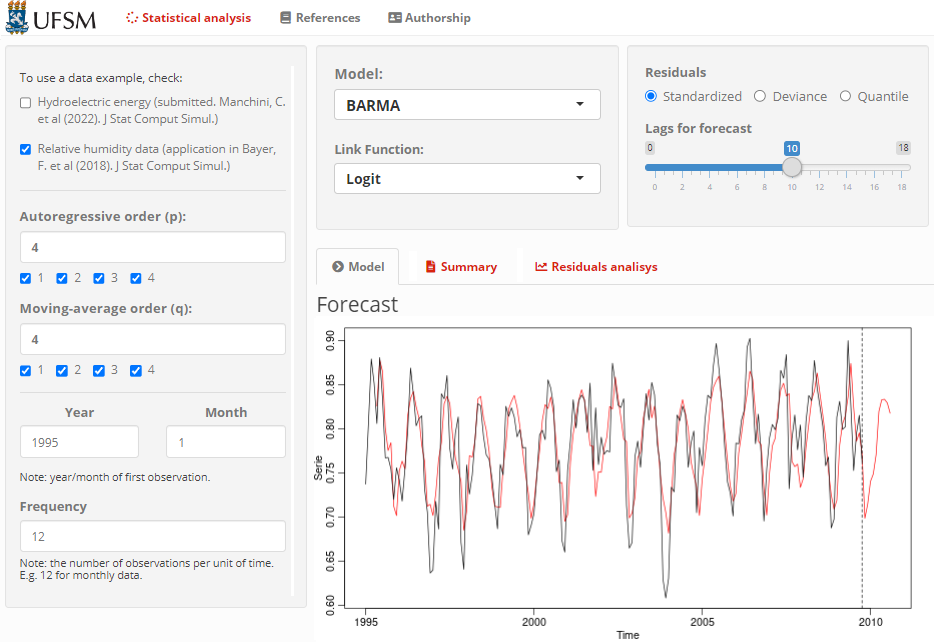
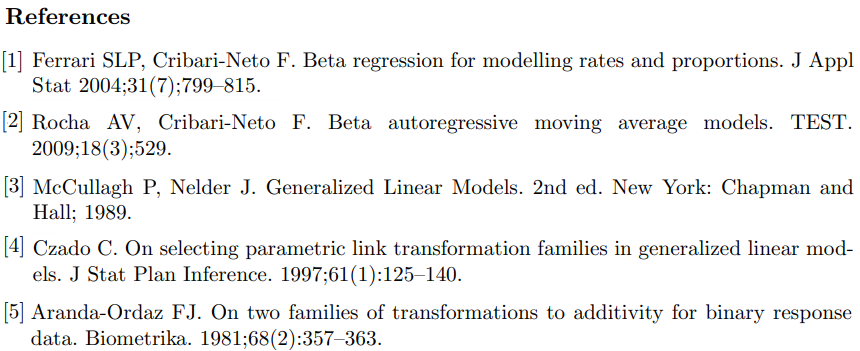

### Shiny Application for Fitting Dynamic Models to Doubly-Bounded Time Series Data

  

Modeling rates and proportions observed over time is a common  problem in many areas of application.  By nature, such time series are limited to the interval $(0,1)$ and, hence, Gaussianity is an assumption that should be avoided [[1]](#fim). In this direction,  the class of beta autoregressive moving average ($\beta$ ARMA) models, proposed by [[2]](#fim), introduces a GLM-like dynamic model for time series restricted to $(0,1)$. The $\beta$ ARMA model assume that, conditionally to its past, the variable of interest follows a beta distribution while the conditional mean is modeled through a dynamical time dependent linear structure accommodating an ARMA-like term and a linear combination of exogenous covariates. The conditional mean is connected to the linear predictor through a suitable fixed link function.

The beta distribution is well known for its flexibility, being able to model asymmetric behaviors such as bathtub, J and inverted J shaped densities, among other. For this reason, the literature has seen a growing interest in beta-based models in the last decade and several improvements and generalizations of the $\beta$ ARMA model have been proposed. 

A common feature in the aforementioned models, the connection between the conditional mean with the linear predictor is made by a suitable link function, ensuring that the modeled conditional mean values do not fall outside its natural bounds. Typical choices for responses taking values in $(0,1)$ are the logit and cloglog fixed links. However, misspecification of the link function may cause distortions in parameter estimation [[3]](#fim). A simple solution to this problem is to apply a parametric link function. This adds flexibility to the model and improves the finite sample performance of maximum likelihood estimation in the context of GLM [[4]](#fim), compared to the canonical ones. 

In this direction, this works generalizes the $\beta$ ARMA model by introducing a parametric link function in the conditional mean specification. Given that a time series following a $\beta$ ARMA lies on $(0,1)$, a suitable link is the Aranda-Ordaz asymmetric link function, introduced in [[5]](#fim). The Aranda-Ordaz link function depends on a parameter $\lambda$ which must be known, or, ideally, estimated from the data. 
Despite the relative growth of the literature on parametric link function, to the best of our knowledge there are no GLM-based time series models considering parametric link functions and there is no package/application for fitting, modeling and predicting data based on this model. Therefore, we propose a web application developed in Shiny and structured in the R programming language to model doubly bounded data with temporal dependence.

The Shiny package enables the exploration of R's graphical and statistical potential by creating dynamic, interactive and digital interfaces. The goal is to enhance accessibility to the BARMA model, since the user does not need knowledge in programming for applications. Additionally, the project aims to promote reproducibility in scientific research through statistical analyses on time series data. The web application is available [here](http://ufsm.shinyapps.io/appARMAs/) .

 
 
 

  

